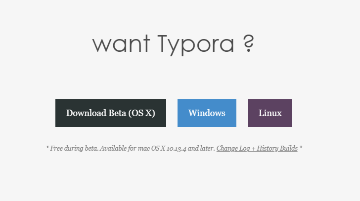

# markdown


   # 一、 该文件是以.md为结尾的文件


##  "##" 属于二级标题

###  "###"3级标题

###### ”######“ 六级标题


### img的使用

-----

使用 "----" 4个短横线和实现下划线/分隔线的效果


#### 使用方式

使用">" 来制作下面的效果

> 


+  "+"可以用来制作列表项

  +  按"tab可以把1级列表变成2级列表"

    + 从上一行按回车健后，继续按*`tab`*可以生成3级*列表*

      + ```html
        
        ```

    + 在上一行按回车健，进入到当前行后，继续按2次回车健，可以从当前列表生成上一级列表

+ 2222   在下级列表时，可以通过多次按回车键回到1级列表

  + 

+ 3333   正常情况下 加号"+"是无序列表  "-"是有序列表


```HTML
使用'```' 数字1旁边的波浪号 按3次。 然后选择语言(html/css/javascript/php/mysql/vue/java)敲击回车

```





> [菜鸟教程:html](https://www.runoob.com/html/html-tutorial.html)


连接形式的文本   快捷键 ctrl+k     [文字] (网络地址)


| 序号 | 姓名 | 性别 | 年龄 | 身高 | 体重 |
| :--: | :--: | :--: | :--: | :--: | :--: |
|      |      |      |      |      |      |


| ---- | ---- | ----- | ----- | ---- |
| :--: | :--: | :---: | ----- | ---- |
|      |      |       |       |      |


 


